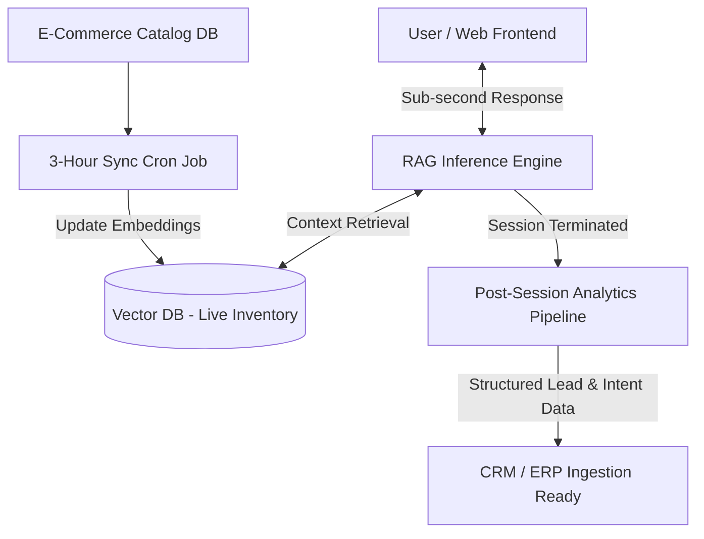

# Production RAG & Dynamic Inventory Pipeline

> **High-Throughput, Low-Latency Customer Support RAG Engine with Dynamic Vector Store Synchronization & Asynchronous Post-Session Analytics**

---

## 📌 Technical Overview

Deploying Retrieval-Augmented Generation (RAG) systems in high-traffic e-commerce environments presents two primary engineering bottlenecks: **high inference latency** and **stale vector context** leading to pricing and inventory hallucinations.

This repository presents the architecture of a production-grade customer support RAG engine designed to eliminate hallucinations, maximize inference throughput, and extract structured business intelligence without impacting real-time user experience.

---

## ⚙️ Key Architectural Pillars

### 1. Sub-Second Latency Execution
* Optimized retrieval chunks and prompt structure to minimize Time-to-First-Token (TTFT) during live user interactions.
* Leveraged **Gemini 2.5 Flash** as the primary inference engine to slash token costs while delivering near-identical accuracy for conversational support workflows.

### 2. 3-Hour Dynamic Vector Sync Pipeline
* E-commerce product catalogs and stock levels fluctuate constantly.
* An automated background worker triggers every **3 hours** to update vector embeddings with real-time inventory, pricing, and FAQ changes. Out-of-stock items are dynamically purged from active context windows to guarantee zero inventory hallucinations.

### 3. Decoupled Post-Session Analytics Pipeline
* To prevent operational overhead in the live chat loop, business analytics processing is completely decoupled from real-time inference.
* Upon session termination, an asynchronous pipeline parses chat transcripts to generate structured lead profiles, sentiment analysis, and intent metadata, making the output ready for CRM/ERP ingestion (e.g., Odoo or custom enterprise pipelines).

---

## 📐 System Architecture Diagram

Metric / Dimension,Standard Baseline Setup,Production Pipeline Architecture
Data Freshness,Manual / Static Batch Indexing,Automated 3-Hour Dynamic Sync
Inference Efficiency,High Latency / Heavy Parameters,Sub-Second Execution via Gemini 2.5 Flash
Context Hygiene,Risk of Inventory Hallucinations,Zero Stock/Price Hallucinations
Data Pipeline Value,Unstructured Raw Chat Logs,Structured Post-Session Lead Analytics
---
🛠️ Tech Stack & Dependencies
Language: Python 3.10+

LLM Core: Gemini 2.5 Flash

Vector Architecture: Dynamic Ingestion & Indexing Pipeline

Integration Layer: Asynchronous Event Hooks & REST Data Connectors
---
👥 Technical Attribution
Engineered in a technical team alongside Mahdi Nateghi and Mohammad Bahrami.
